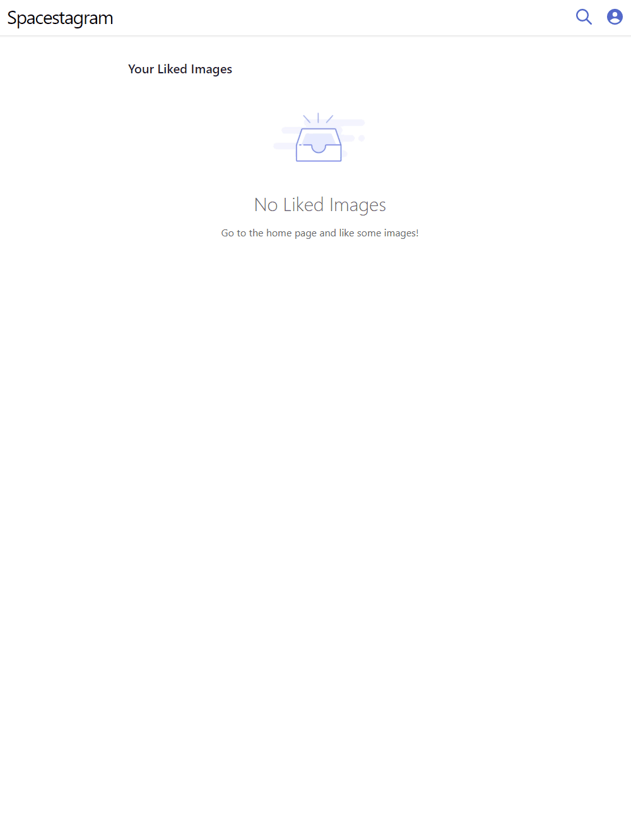
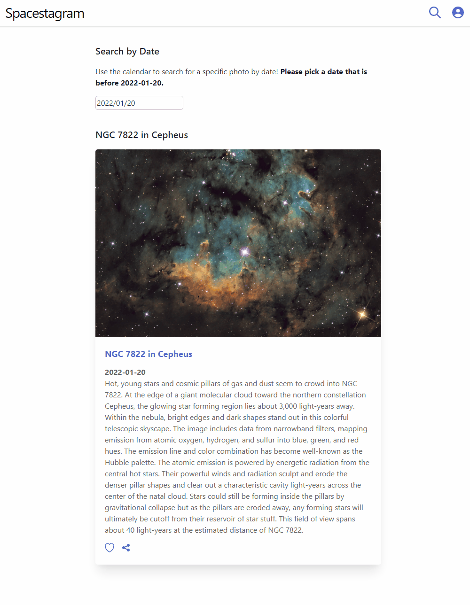
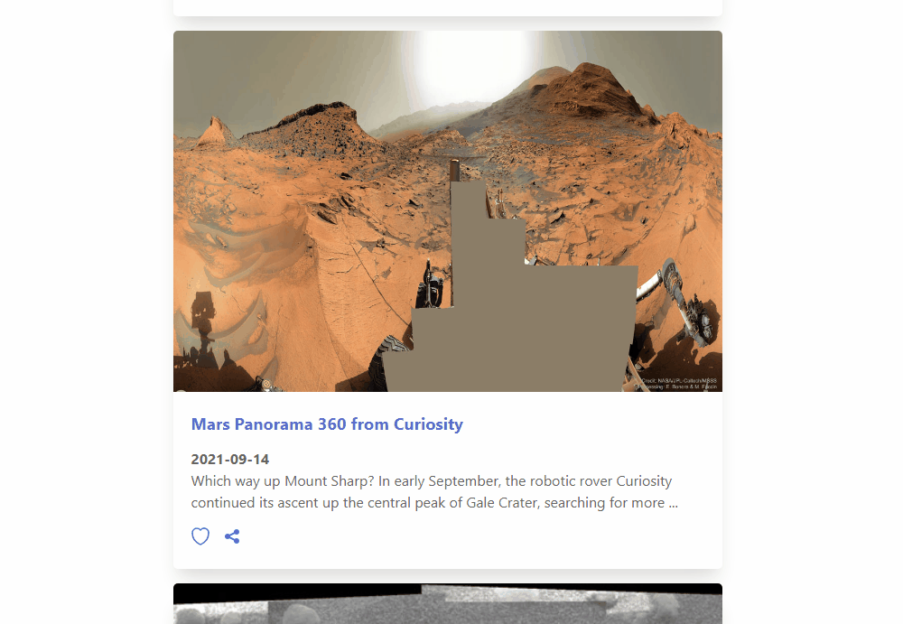
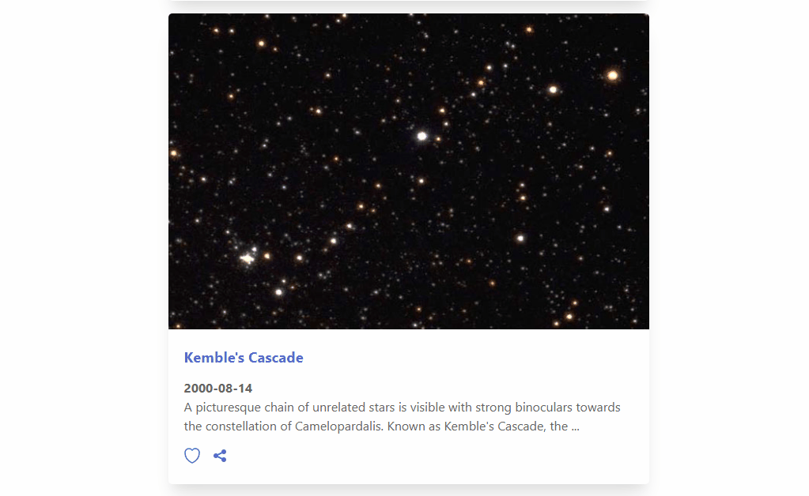

# 🚀 Spacestagram: Image Sharing From the Final Frontier

This app was created for Shopify's Summer 2022 Front End Developer Intern Challenge.

On top of the specified features of fetching and liking images, I added extra features such as searching, saving likes, and shareable links! My goal with this project was to develop an app that has a legible design and is easy to use, while going above and beyond with extra features and quality of life changes. 

- [Access the Deployment](https://thomasjnl-shopify-summer-2022.netlify.app/)
- [Challenge Specifications](https://docs.google.com/document/d/13zXpyrC2yGxoLXKktxw2VJG2Jw8SdUfliLM-bYQLjqE/edit?usp=sharing)

## Table of Contents

- [Tools Used](#tools-used)
- [Testing](#testing)
- [Specified Features](#specified-features)
  - [Fetching and Displaying Image Data](#fetching-and-displaying-image-data)
  - [Liking and Unliking Images](#liking-and-unliking-images)
- [Extra Features](#extra-features)
  - [Image Searching using a Date-picker](#image-searching-using-a-date-picker)
  - [Shareable Links for Images](#shareable-links-for-images)
  - [Loading More Images](#loading-more-images)
  - [Saving Likes Between Reloads](#saving-likes-between-reloads)
  - [User Feedback using Toasts](#user-feedback-using-toasts)
- [Reflections](#reflections)
- [Running the Project](#running-the-project)

## Tools Used
- React.js 
  - React Router
  - Redux
  - Fetch API
- TypeScript
- Chakra UI
- Jest
- [NASA's APOD Image API](https://api.nasa.gov/)


## Testing
Unit tests have been written for the liked images list component in ```\src\components\LikedImagesList\LikedImagesList.test.tsx``` 

This tests that the component renders liked images correctly, and a "no liked images" message when there are no liked images. You can run this test by running: 

```yarn test```

## Specified Features
### Fetching and Displaying Image Data

### Liking and Unliking Images


## Extra Features
### Image Searching using a Date-picker

### Shareable Links for Images

### Loading More Images

### Saving Likes Between Reloads
Likes are saved to local storage so users can access them after leaving the site. 
### User Feedback using Toasts


## Reflections
If I had more time, I'd like to write more tests, making sure all components are rendered correctly. I'd also write tests for the asynchronous functions, using mocks to ensure image data is rendered correctly when a response is received.

I'd also like to add animations to my app using Framer Motion, and create effects like images popping in when loaded, and the heart and share icon animating when clicked. 

## Running the Project

You can clone this repository by running:

```
git clone https://github.com/ThomasJnLiu/shopify-summer-2022.git
```

In the project directory, you can run:

```
yarn start
```

Runs the app in the development mode.\
Open [http://localhost:3000](http://localhost:3000) to view it in the browser.

The page will reload if you make edits.\
You will also see any lint errors in the console.


